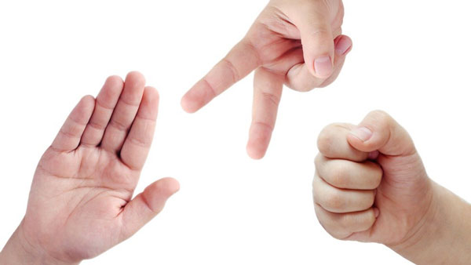
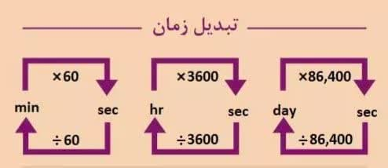
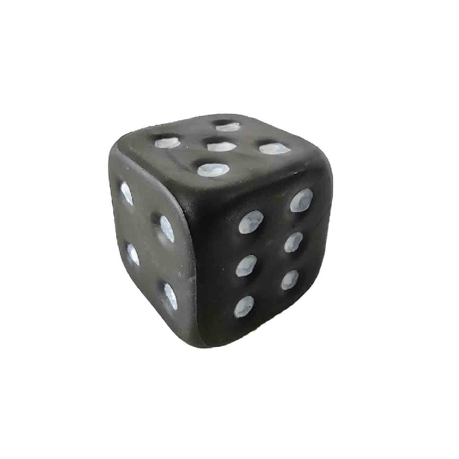
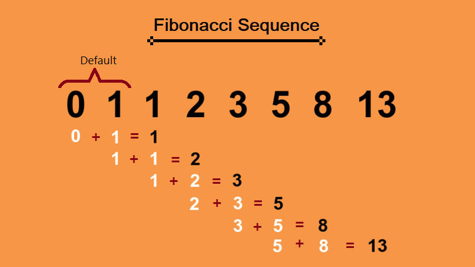

# Assignment2

## Rock_Paper_Scissors Game (part1)
in this game, if each side gets 3 points first or gets the most points, it is the winner

---
## Convert second to time and vise versa (part2)
in this code, seconds are received as input from the user and converted to hours or vise versa

---
## Guess number Game (part3)
in the number guess game, after winning print the number of users guesses
---
## Dice🎲 (part4)
We simulated the dice in such a way that if 6 comes up, it has a prize and it can throw the dice again, if other numbers come up, it has to continue moving

---
## Averaging (part5)
in this part, until the user enters the exit statement, the students grades receives and finally print the grade point average of the student

---
## Fibonacci sequence (part6)
in this program, the number of sequence elements is received from the user and then it jumps the sequence

